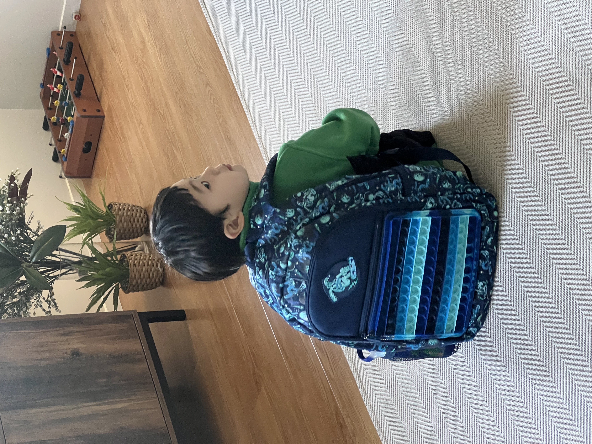

 
오늘은 다니엘이 학교에 간 첫 날이다.
 

뉴질랜드는 1학년부터 13학년까지 1년에 4학기제로 운영된다. 만 5살이 되면 1학년에 입학할 자격이 주어지고 텀(학기)이 시작될 때 수업에 참여할 수 있다. 한국의 초등학교처럼 입학식을 하지는 않고, 학교가는 해에 유치원에서 졸업파티를 성대학게(?) 해주는 것 같다. 다니엘은 지난 주 내내 감기 때문에 아파서 졸업식을 못했다.  코로나처럼 심하게 앓은 탓에 등교 첫 날 결석을 해야할까봐 노심초사 했지만, 다행히 기침만 남기고 열은 떨어져서 무사히 등교할 수 있었다. 물론 아침에 '학교가기 무섭네, 엄마랑 떨어지기 싫네'라며 눈물을 글썽이며 어린양을 했지만 안가고 별 수 있나. 도메스틱이 아닌 인터네셔널 학비는 한 두푼 하는게 아니다. ㅠㅠ

여튼 첫 학교일정을 무사히 마치고, 하교 길에 웨어하우스에 들러서 원하는 로봇도 한 개 사줬다.

수고했어 아들, 내일도 엄마랑 잘 떨어질거지?  
아빠도 내일은 학교 갈거야 - _-/

사랑해~~

-------

 
Today was Daniel's first day at school. 
 

In New Zealand, the school system operates on a four-term basis from Year 1 to Year 13. Once a child turns five, they are eligible to enter Year 1 and can participate in classes at the start of each term. Unlike Korean elementary schools, there are no formal entrance ceremonies, but kindergartens seem to have grand graduation parties in the year of school commencement. Unfortunately, Daniel missed his graduation ceremony last week because he was sick with a cold. The illness was so severe, almost like COVID, that we were worried he might have to miss the first day of school. Luckily, his fever subsided, leaving only a cough, and he was able to attend school. Of course, in the morning he was a bit scared to go to school, teary-eyed and saying he didn't want to be away from mommy, but what could we do? International school fees aren't a small amount. 

Anyway, he made it through his first day at school, and on the way home, we even stopped at The Warehouse to buy him the robot toy he wanted. 

Well done, my son. You'll be fine without mom tomorrow, right?   
Dad will also go to school tomorrow - _-/

Love you~~

")
