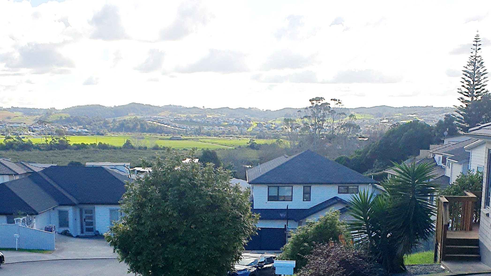

 
일상의 소소함은 때론 행복이라는 이름으로 찾아온다.
 

평범한 오후, 나는 따스한 햇살을 받으며 창가에 앉아 있다. 시간은 느리게 흘러가고, 마음의 한 켠에서 먼지 쌓여가는 오래된 기억들이 잠에서 깨어난다. 갑작스레 찾아온 이 여유로운 시간 속에 커피가 빠질 수 없다.

소박해 보일 수 있는 물 끓이는 순간에도, 행복은 스며든다. 뜨거운 물이 점점 끓어올라가는 모습을 바라보며, 나는 미래에 대한 무게감을 잠시 내려놓는다. 창 밖으로 보이는 푸른 나무들과 붙박이 집들, 그 안정감이 나를 감싸 안는다.

그때, 앞집의 고양이가 마실을 나온다. 녀석은 오늘도 나의 데크를 찾아와 호기심 가득한 눈으로 둘러본다. '아마, 녀석도 나처럼 이 여유를 즐기는 거겠지?' 나는 녀석을 바라보며 생각한다.

이렇게 고요한 시간이 흐르는 동안, 나는 일상의 조용한 아름다움을 발견한다. 마치 커피 향처럼 소박하면서도 고요한 행복이 내 마음을 채운다. 그 향기를 음미하며, 나는 커피 잔을 천천히 들어올린다.

----


Sometimes, the simple things in everyday life show up under the name of happiness.


On an ordinary afternoon, I sit by the window, soaking up the warm sunlight. Time passes slowly, and the dusty, age-old memories that have been collecting in a corner of my mind start to wake up from their slumber. In this unexpected moment of leisure, coffee is an inevitable thought.

Even in the seemingly simple act of boiling water, happiness seeps in. Watching the hot water slowly start to boil, I temporarily put down the weight of my future concerns. The sight of the green trees and terraced houses outside my window provides a soothing embrace.

At that moment, the neighbor's cat comes out for a stroll. She, as always, finds her way onto my deck, surveying her surroundings with eyes full of curiosity. 'Perhaps, she too is enjoying this leisure time just like me?' I ponder as I watch her.

During these tranquil moments as they pass by, I discover the quiet beauty of everyday life. Like the aroma of coffee, a simple yet serene happiness fills my heart. Savoring this scent, I slowly lift my cup of coffee.