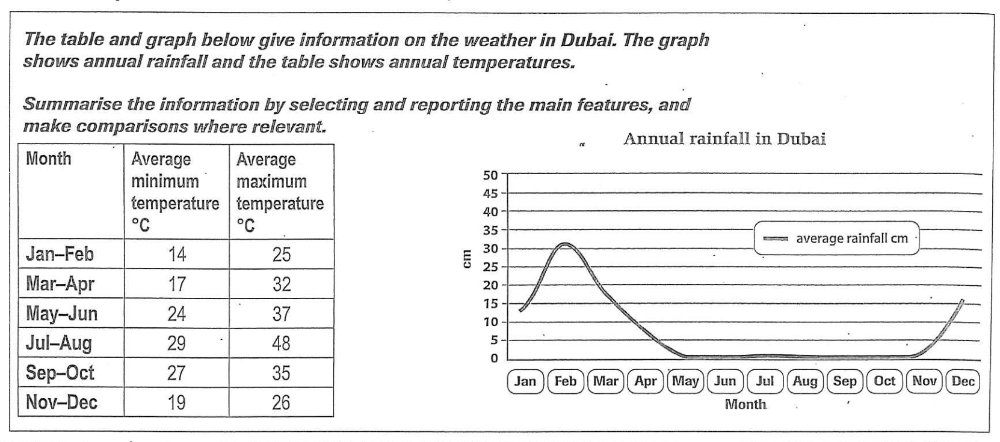

# Average Temperature and Rainfall in Dubai

**Introduction:**   
The table and line graph present the monthly variations in average temperature and rainfall in Dubai throughout the year. The purpose of these surveys is to discern patterns and correlations between temperature and precipitation over the course of a year. The units of measurement are degrees Celsius for temperature and centimeters for rainfall. The data has been collated from the Dubai Meteorological Department.

**Overall:**    
There is a noticeable correlation between the annual temperature and rainfall in Dubai. Specifically, the warmer months tend to have less rainfall, emphasizing that the hotter months are typically drier.

**Paragraph 2:**    
`To begin with`, in the months of January and February, the minimum temperature was recorded at 14°C and the maximum at 25°C. `Following that`, in March and April, there was an uptick in both minimum and maximum temperatures, recorded at 17°C and 32°C respectively. `In terms of the trend`, the temperature consistently rose as the months progressed. By July and August, the minimum temperature reached its peak at 29°C, while the maximum soared to a sweltering 48°C. `With regard to the maximum temperature`, it demonstrated a consistent increase from January, peaking in July-August, and then seeing a decline towards the end of the year.

**Paragraph 3:**    
`Turning to annual rainfall`, January started with 14 cm. This figure surged, peaking at 32 cm in February. `This was followed by` a steep drop, with May registering no rainfall, a trend that persisted until October. `In the ensuing months`, notably after October, there was a sharp rise in precipitation, with December recording 16 cm.

`In terms of the overall patterns`, while temperatures in Dubai rise during the middle of the year, rainfall experiences a decline, underscoring the inverse relationship between these two variables in the region.
