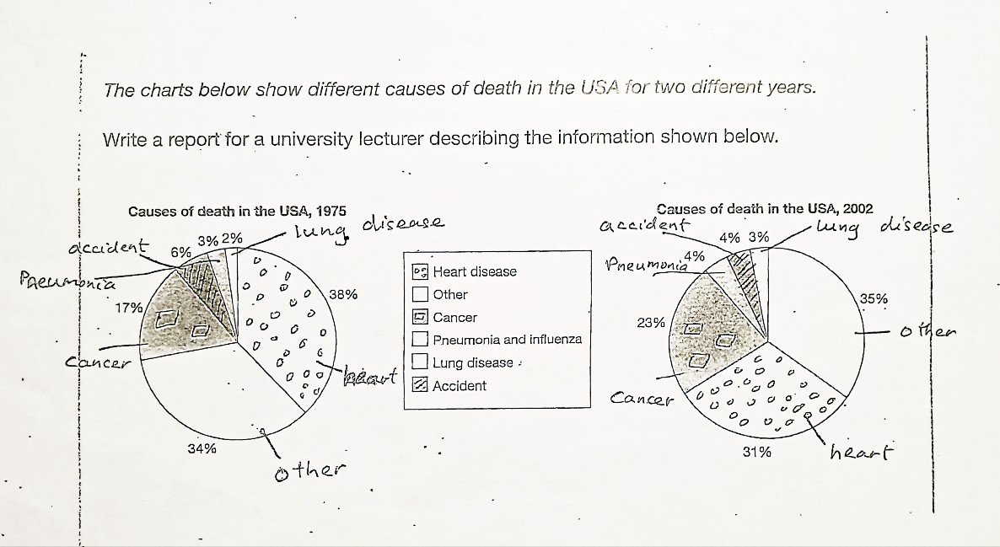

# Charts Showing Different Causes of Death in the USA for Two Different Years


The charts below show different causes of death in the USA for two different years. Write a report for a university lecturer describing the information shown below.


### My Writing

The pie charts `display` the `proportion of` six `primary culprits of` death in the USA, and `this survey was conducted in` 1975 and 2002.

`Overall`, heart disease and 'other' were the root causes of death `throughout the survey`, while lung disease showed the least.

`To begin with`, in 1975, a `substantial proportion of` 38% `was seen in` heart diseases, and that of 'other' was 4% less than heart diseases. `This was followed by` cancer, `which was half that of` 'other'. `Following that`, accident, pneumonia, and lung disease `illustrated` `a marginal difference`, `which ranged between` 6% and 2% `in order`.

`Turning to 2002`, the category of 'other' showed an `increasing trend,` and it had a `considerable percentage of` 35%. `A similar trend was illustrated in` cancer, which had `slightly less than a quarter at` 23%. As for pneumonia and lung disease, they `presented a proportional pattern to` cancer, `as the former` had 4% `while the latter` was `depicted at` 3%. `In terms of` heart disease and accident, they presented an `inversely proportional tendency shown as` 31% and 4%, `respectively`. (178 words)


The report does a commendable job at providing a structured and concise analysis of the differences in causes of death for the two years. Here are some observations and suggestions:

**Strengths**:
1. **Clear Introduction**: The introduction effectively sets the context by mentioning what the pie charts display and the years in which the surveys were conducted.
2. **Use of Comparative Language**: The report uses comparative language like "a substantial proportion," "half that of," and "marginal difference" which aids in understanding the data more intuitively.
3. **Logical Structure**: The data is structured logically, first discussing 1975 and then 2002, which makes it easy to follow.

**Areas for Improvement**:
1. **Specific Data Points**: It might be helpful to have specific data points for all categories, especially for 1975 where there's a mention of a "marginal difference" between accident, pneumonia, and lung disease, but exact percentages are given only for lung disease.
2. **Consistency in Descriptions**: While the description for 1975 uses terms like "substantial proportion" and "half that of," the 2002 description is more direct with percentages. It might be more effective to maintain a consistent style throughout.
3. **Clarification on Trends**: The statement "Turning to 2002, the category of 'other' showed an increasing trend" implies a comparison with 1975, but the 1975 value for 'other' isn't explicitly mentioned before this. So, readers might have to backtrack to understand the trend. 

**Minor Stylistic Points**:
- The phrase "root causes of death" might be more accurately described as "leading causes of death."
- Instead of "this survey was conducted," it might be more direct to say "data is from 1975 and 2002."

Overall, the report does a good job at providing an overview of the data from the charts. With a few refinements, it could be even more effective in conveying the information clearly and concisely.



The pie charts `illustrate` the distribution of six `primary causes of` death in the USA for the years 1975 and 2002.

Overall, heart disease and the 'other' category `dominated as leading causes of mortality during these years`, with lung disease accounting for `the smallest portion`.

In 1975, heart diseases `took the lead`, `making up` 38% of the deaths, `closely followed by` the 'other' category at 4% less. Cancer was the next `significant cause`, `standing at half the percentage of` the 'other' category. Deaths due to accidents, pneumonia, and lung disease were relatively close, `with percentages spanning` from 2% to 6%.

By 2002, `there was a noticeable rise in` the 'other' category, reaching 35%. Cancer also saw an `uptick`, accounting for 23% of the deaths. Pneumonia and lung disease `mirrored each other in proportions`, with 4% and 3% `respectively`. Heart disease, `though still significant`, reduced to 31%, `whereas` accidents `remained consistent at` 4%.

